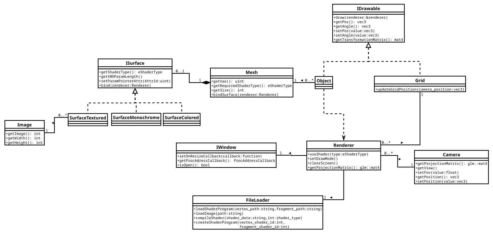

# LOS
Light OpenGL Scene

# Overview
LOS is a library that let you create a scene with a camera in which you can place object
with different kind of surfaces.
Those objects can be scaled, moved or rotated.

LOS does not provide the open gl context, it has to be used with GLFW, SFLM or Qt for exemple

# Architecture
